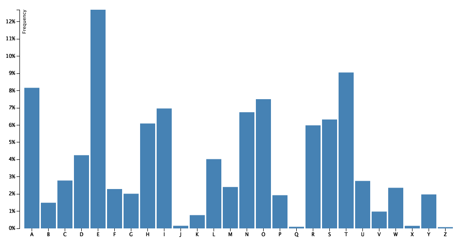

## BarChart

BarChart generator in node.js.

## Install

```bash
npm install d3node-barchart
```

## Usage

```js
const d3nBar = require('d3node-barchart');
const bar = d3nBar(data, selector, container, style)
```

Check out the [example](./example) for usage.

##### Output the visualization result to a image

```
npm start
```

## Output Preview (png):




## API

### d3nBar(data[, selector, container, style])

#### options

##### data

- Type: `Array`

Data from file or web processed by d3 library.

##### selector

- Type: `String`
- Default: `'#chart'`

DOM selector in container.

##### container

- Type: `String`
- Default: `<div id="container"><h2>Bar Chart</h2><div id="chart"></div></div>`

DOM contain the visualization result.

##### style

- Type: `String`<br>
- Default:
```html
.bar{fill: steelblue;}
.bar:hover{fill: brown;}
.axis{font: 10px sans-serif;}
.axis path,.axis line{fill: none;stroke: #000;shape-rendering: crispEdges;}
.x.axis path{display: none;}
```

##### width

- Type: `Number`
- Default: `960`

##### height

- Type: `Number`
- Default: `500`

##### margin

- Type: `Object`
- Default without labels: `{ top: 20, right: 20, bottom: 30, left: 40 }`
- Default with labels: `{ top: 20, right: 20, bottom: 40, left: 50 }`

##### barColor

- Type: `String`
- Default: `steelblue`

##### barHoverColor

- Type: `String`
- Default: `brown`

##### labels

- Type: `Object`
- Default: `{ xAxis: '', yAxis: '' }`

## Contributing

1. Fork it!
2. Create your feature branch: `git checkout -b my-new-feature`
3. Commit your changes: `git commit -am 'Add some feature'`
4. Push to the branch: `git push origin my-new-feature`
5. Submit a pull request :D


### LICENSE

[MIT](LICENSE) &copy; [d3-node](https://github.com/d3-node)
